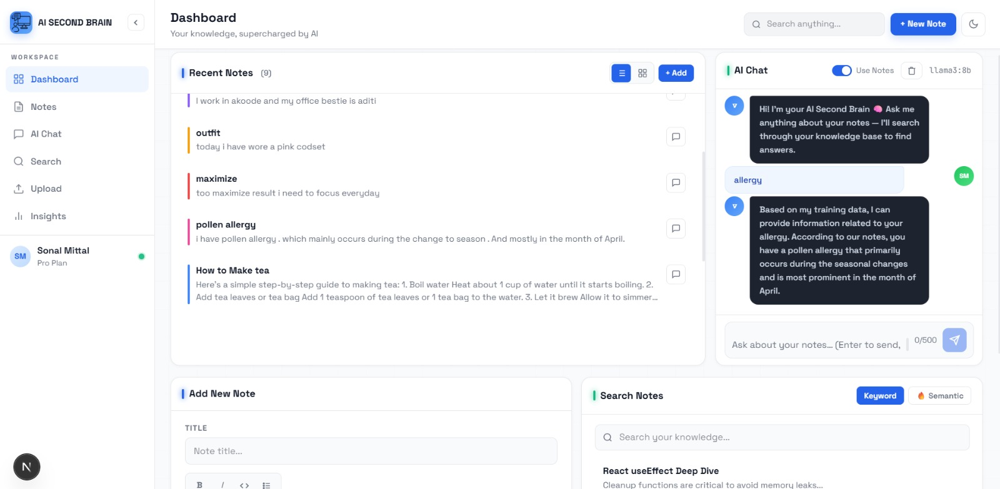
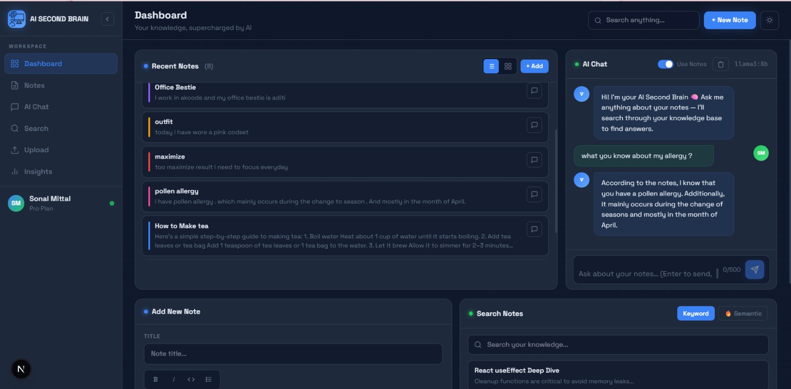
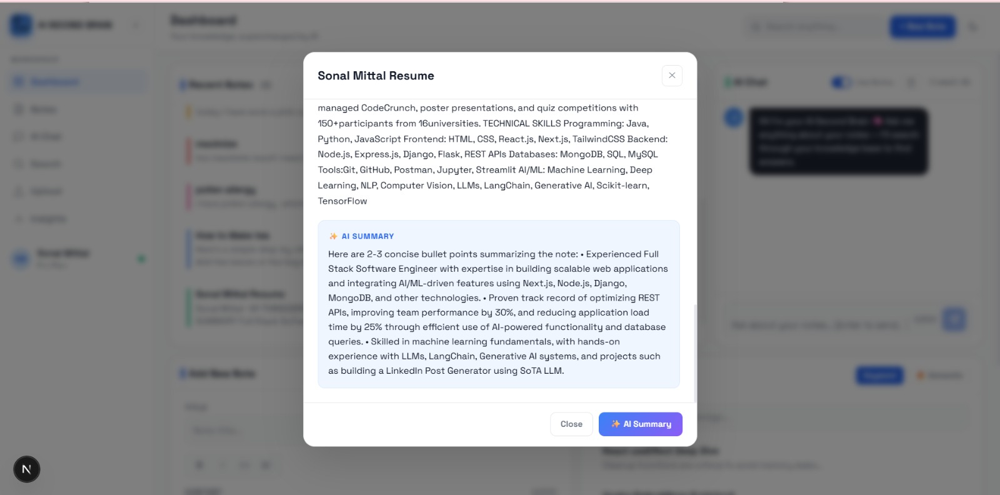
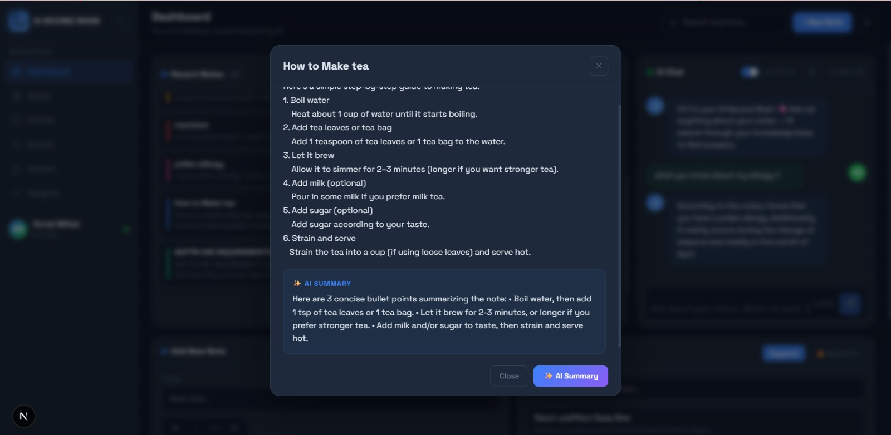
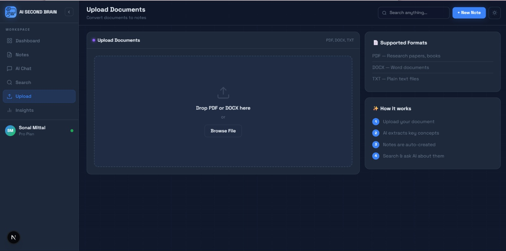

# 🧠 AI Second Brain

🚀 Built with RAG + LLMs to create a personal AI knowledge assistant

An AI-powered knowledge management system that stores notes, understands them using RAG, and answers questions intelligently.

---

## 🚀 Features

- 📝 Store and manage notes  
- 🤖 Ask AI questions based on your notes (RAG-based system)  
- 📄 Upload PDFs and perform Q&A on them  
- ✨ Summarize notes and PDF content  
- 🔍 Smart search across all stored data  

---

## 🛠️ Tech Stack

* Frontend: Next.js, TypeScript
* Backend: FastAPI
* Database: MongoDB
* AI: Ollama + RAG

---

## 🧠 How It Works

- Notes & PDFs are stored in MongoDB  
- User query → relevant notes retrieved (RAG)  
- Context passed to LLM (Ollama)  
- AI generates accurate answer  
- Also supports summarization   

---

## 📸 Screenshots

### 🏠 Dashboard | 🤖 Ask AI (Light / Dark)




### ✨ AI Summary

 
 

### 📄 Upload PDF

 

---

## ⚙️ Setup

```bash
git clone https://github.com/mittalsonal/AI-Second-Brain.git
cd ai-second-brain
```

### Frontend

```bash
cd frontend
npm install
npm run dev
```

### Backend

```bash
cd backend
pip install -r requirements.txt
uvicorn app.main:app --reload
```

---

## ⭐ Features Highlight

* RAG-based intelligent answering
* Context-aware responses
* Notes + PDF understanding system

---

⭐ If you like this project, give it a star!
