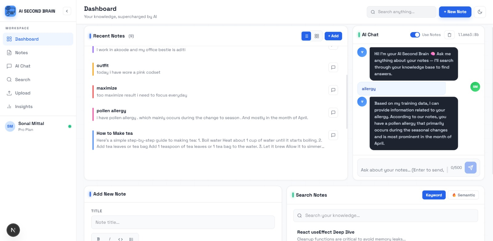
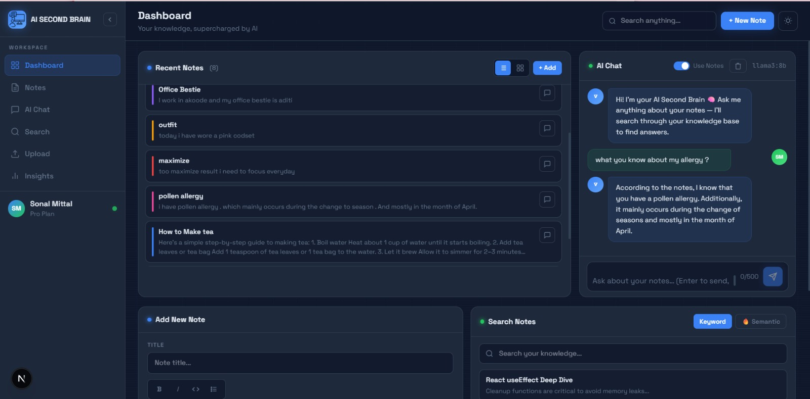
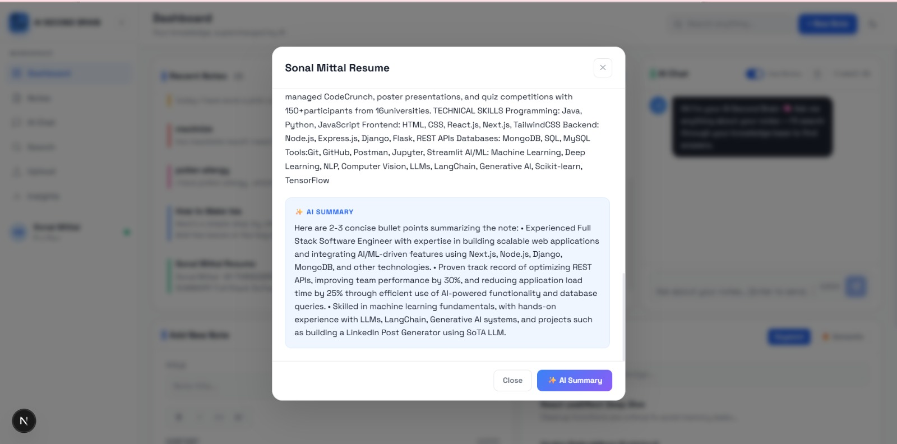
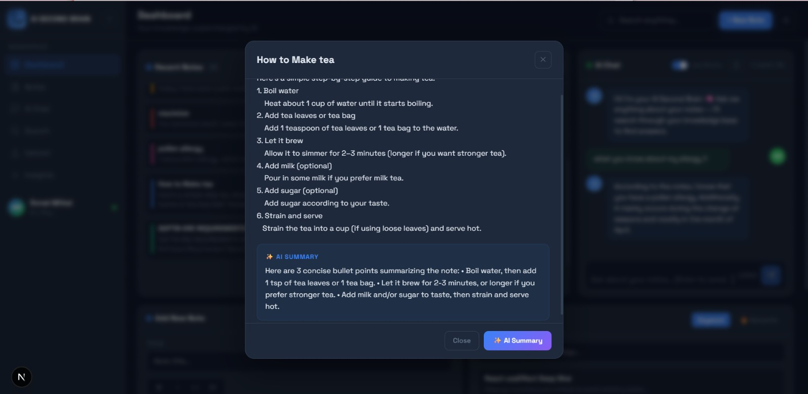
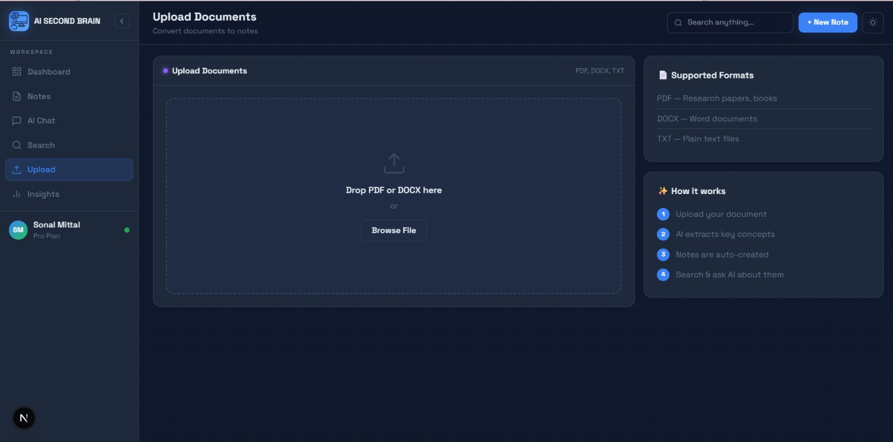

# 🧠 AI Second Brain

🚀 Your Personal AI Knowledge Assistant powered by RAG + Hybrid Intelligence

An advanced AI system that doesn’t just store information — it understands, retrieves, and intelligently responds using both your personal knowledge and general intelligence.

---

## 🚀 Features

- 📝 Smart Note Storage  
  Store and manage your personal knowledge  

- 🤖 AI Q&A (Hybrid RAG System)  
  - Answers from your notes (RAG-based)  
  - Falls back to general knowledge if needed  
  - Clearly mentions when answer is not from notes  

- 🧠 Semantic Search with Embeddings  
  Uses Sentence Transformers for meaning-based retrieval  

- 📄 Document Understanding (PDF / DOCX / TXT)  
  Upload files → auto chunking → ask questions  

- ✨ AI Summarization  
  Get concise summaries of notes and documents  

- 🎯 Multi-Question Handling  
  Handles multiple questions in one query  

- 📊 System Stats  
  Tracks notes count and AI usage  

---

## 🛠️ Tech Stack

**Frontend**
- Next.js
- TypeScript
- Tailwind CSS  

**Backend**
- FastAPI  

**Database**
- MongoDB  

**AI / ML**
- Ollama (LLaMA3)
- Sentence Transformers (Embeddings)
- Cosine Similarity (Vector Search)

---

## 🧠 How It Works

### 1. Data Processing
- Notes & documents stored in MongoDB  
- Each note converted into vector embeddings  

### 2. Query Understanding
- User query → embedding  
- Compared with stored notes using cosine similarity  

### 3. Retrieval (RAG)
- Top relevant notes selected dynamically  
- Context created from best matches  

### 4. Hybrid AI Response
- If answer exists in notes → uses notes  
- If not → uses general knowledge  
- Adds transparency:
  "This information is not from your personal notes."

### 5. Output
- Returns answer  
- Shows sources only when relevant  

---

## 👩‍💻 What I Built 

I designed and developed this project end-to-end, including: 

- The responsive frontend using Next.js, TypeScript, and Tailwind CSS
- Backend APIs using FastAPI and Python
- MongoDB integration for storing notes and document information
- PDF, DOCX, and TXT document-upload workflows
- Text extraction, chunking, and embedding generation
- Semantic search using Sentence Transformers and cosine similarity
- A RAG pipeline for retrieving relevant personal context
- Hybrid response logic for personal and general knowledge
- AI-powered note and document summarization
- Transparent fallback messaging when an answer is not supported by the user's notes
- Light and dark user-interface experiences

The most challenging part was determining when the system had enough relevant context to answer from the user's documents and when it should fall back to general knowledge.

I addressed this by implementing similarity-based retrieval and clear fallback messaging so users can understand whether an answer came from their personal knowledge base. 

---

## ⚡ Why This Project Stands Out

- Combines personal knowledge retrieval with general AI intelligence
- Uses semantic search instead of basic keyword matching 
- Hybrid system (RAG + General Knowledge)  
- Semantic search (not just keyword matching)  
- Handles edge cases intelligently  
- Designed like a real-world AI product  

---

## 📸 Screenshots

### 🏠 Dashboard | 🤖 Ask AI




### ✨ AI Summary

  
  

### 📄 Upload Document

  

---

## ⚙️ Setup

```bash
git clone https://github.com/mittalsonal/AI-Second-Brain.git
cd ai-second-brain
```

### Frontend

```bash
cd frontend
npm install
npm run dev
```

### Backend

```bash
cd backend
pip install -r requirements.txt
uvicorn app.main:app --reload
```

---

## ⭐ Features Highlight

* RAG-based context-aware answering
* Semantic search with vector embeddings
* Notes and document understanding
* Hybrid personal and general knowledge responses
* Context-aware responses
* Notes + PDF understanding system
* End-to-end full-stack AI implementation

---

## 🔮 Future Improvements 

- Add authentication and separate knowledge bases for individual users
- Add support for more document formats and larger files
- Introduce a dedicated vector database
- Add retrieval-quality evaluations
- Improve source citations at the document-chunk level
- Add conversation memory and knowledge organization
- Deploy the complete AI pipeline for public use

---

## 👤 Author

**Sonal Mittal** 

Full Stack Developer and AI Engineer 
- GitHub: [mittalsonal](https://github.com/mittalsonal)
- Email: sonalmittal140103@gmail.com
- LinkedIn : https://www.linkedin.com/in/mittalsonal/
- Portfolio : https://sonalmittal.vercel.app/

---

⭐ If you find this project useful, consider giving it a star!
